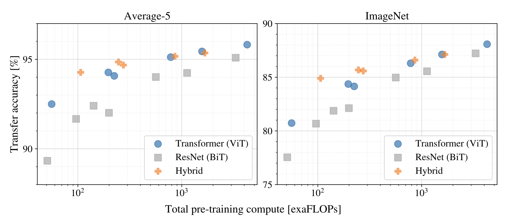

# AN IMAGE IS WORTH 16×16 WORDS: Transformers for Image Recognition at Scale

## Vision Transformer (ViT) - ICLR 2021

**Paper:** An Image is Worth 16x16 Words: Transformers for Image Recognition at Scale
**Authors:** Alexey Dosovitskiy*, Lucas Beyer*, Alexander Kolesnikov*, Dirk Weissenborn*, Xiaohua Zhai*, Thomas Unterthiner, Mostafa Dehghani, Matthias Minderer, Georg Heigold, Sylvain Gelly, Jakob Uszkoreit, Neil Houlsby*

**Institution:** Google Research, Brain Team
**Conference:** ICLR 2021
**ArXiv:** https://arxiv.org/abs/2010.11929
**Code:** https://github.com/google-research/vision_transformer

**Presented by:** Seema Dhungana

**Date:** October 30, 2025

---

## Overview: Breaking CNN Dominance in Computer Vision

### The Central Problem

For decades, **convolutional neural networks (CNNs)** dominated computer vision. Every breakthrough—AlexNet (2012), VGG, ResNet, EfficientNet—built upon convolution with strong **inductive biases**.

#### What is a Convolution?

Think of a **convolution** as a small magnifying glass (say, 3×3 pixels) that slides across an entire image, looking for specific patterns. 

- Place the magnifying glass on the top-left corner
- Examine those 9 pixels: "Do I see an edge here? A corner? A texture?"
- Slide the magnifying glass one pixel to the right
- Repeat across the entire image

That sliding magnifying glass is a **convolutional filter**. Early filters detect simple patterns (edges, textures), later filters detect complex objects (faces, cars). This hierarchy is **built into the architecture**—that's what makes it a strong inductive bias.

#### The Three Built-in Assumptions (Inductive Biases)

CNNs come with a "strategy book" for understanding images—assumptions baked into their design:

**1. Locality: "Nearby pixels are friends"**
- A dog's eye pixels stick together; they're unrelated to distant tree pixels
- The 3×3 magnifying glass only looks at neighbors
- To see far away, you need many layers stacked (building a larger "receptive field")

**2. Translation Equivariance: "A cat is a cat, anywhere"**
- The same cat detector works whether the cat is top-left or bottom-right
- The magnifying glass uses the **same weights** as it slides across the whole image
- Efficient: no need for separate detectors for each position

**3. Hierarchical Structure: "Simple → Complex"**
- Layer 1: Sees 3×3 → detects edges
- Layer 5: Sees 50×50 → combines edges into shapes
- Layer 10: Sees 200×200 → combines shapes into objects (dog, car)
- This pyramid is **forced by design**

#### The Analogy: Two Ways to Learn

Imagine teaching someone to recognize dogs:

**CNN approach (High Inductive Bias):**
"Here's your strategy book:
- Chapter 1: First, look for furry textures
- Chapter 2: Then, look for four legs and a tail  
- Chapter 3: Finally, combine those into 'dog'

You'll learn faster, but you must follow this hierarchy."

**ViT approach (Low Inductive Bias):**
"Here's a pile of 300 million photos of dogs. Figure out your own strategy."

With 1,000 photos, the strategy book wins.  
With 300 million photos, learning your own strategy wins.

#### Meanwhile, in NLP...

**Transformers** revolutionized natural language processing through pure self-attention:
- No built-in assumptions about word order or grammar
- Scaled to 100B+ parameters (BERT, GPT)
- Learned language patterns from massive pre-training data

#### The Central Question

**Can we apply a standard Transformer directly to images with minimal modifications?**  
**Could pure attention (without convolutions) match or exceed CNNs?**

### The Approach

<table>
<tr>
<td>

**ViT's elegant solution:**

1. Split image into fixed-size patches (e.g., 16×16 pixels)
2. Flatten each patch into a 1D vector
3. Linearly project to embedding dimension
4. Add learned position embeddings
5. Prepend a learnable [CLS] token (like BERT)
6. Process with standard Transformer encoder
7. Classify using [CLS] token output

**That's it.** No convolutions. No complex architectural innovations. Just patches + attention.

</td>
<td width="50%" align="center">
  <br>
  <em>Figure 1:</em> ViT architecture overview
</td>
</tr>
</table>

---
## Understanding the Core Transformation
### Question 1: ViT processes images as sequences of patches. Why not just process each pixel as a token?

<details>
<summary><b>Hint:</b> Think about how attention scales with sequence length!</summary>

**Answer:**

**Processing individual pixels would be impossible:**
- 224×224 = 50,176 tokens
- Self-attention has O(N²) complexity
- 50,176² = 2.5 billion attention computations per layer!
- Would require massive memory and be extremely slow

**Patch size directly controls cost:**

| Patch Size | # Patches | Attention Cost |
|------------|-----------|----------------|
| 32×32 | 49 | 49² = 2,401 |
| 16×16 | 196 | 196² = 38,416 |
| 8×8 | 784 | 784² = 614,656 |

Going from 16×16 to 8×8 patches = **16× more expensive** (4× more tokens → 16× attention cost)

**The trade-off:**
- **Larger patches (16×16, 32×32):** Fast but loses fine details
- **Smaller patches (8×8, 4×4):** Captures details but very expensive
- **ViT-L/16 sweet spot:** 196 patches balances quality and efficiency

**Key insight:** Patches are a pragmatic compression strategy. ViT would work better with pixels, but it's computationally infeasible!

</details>

---

### Key Finding: Scale Trumps Inductive Bias

**Critical experiments across dataset sizes:**

| Dataset Size | Winner | Accuracy |
|-------------|--------|----------|
| ImageNet (1.3M) | ResNet | Higher |
| ImageNet-21k (14M) | ~Tied | Similar |
| JFT-300M (300M) | **ViT** | **88.55%** |

**The paradigm shift:** With sufficient data, general-purpose architectures (Transformers) can match or exceed specialized architectures (CNNs) while using **2-4× less pre-training compute**.


**Figure 3:** Shows transfer performance on ImageNet when pre-training on datasets of increasing size (ImageNet, ImageNet-21k, JFT-300M). ViT underperforms on small data but exceeds ResNets on large-scale datasets.

---

### Question 2: When trained on ImageNet (1.3M images), why does ViT-Large underperform compared to ResNet of similar size? What changes when you use 300M images?

<details>
<summary><b>Hint:</b> Consider what CNNs have built-in that Transformers must learn from data</summary>

---

**Answer:**

**Small data (1.3M images):**
- CNNs have built-in assumptions: nearby pixels matter, objects can shift position, features build hierarchically
- ViT starts with no assumptions—must learn everything from data
- Not enough examples to learn what CNNs get for free
- **ViT loses**

**Large data (300M images):**
- ViT learns spatial patterns, attention, hierarchy from examples
- Turning point: ~14M images
- **ViT wins** (88.55% on ImageNet)

---

**Key Insight:** Built-in biases help with little data but limit peak performance. With enough data, learning from scratch beats hard-coded assumptions.


**Figure 4:** Linear few-shot evaluation showing ResNets plateau quickly while ViT continues improving with more pre-training data.

</details>

---
## Vision Transformer (ViT) — Formal Pseudocode 


```markdown
Algorithm 1  ViT(x | Θ)
Input:  Image x ∈ ℝ^{H×W×C}
Param:  Θ = {E, E_pos, x_cls, {blockₗ}ₗ₌₁^L, W_head}

1  Split x into P×P patches → X_p ∈ ℝ^{N×(P²C)}      // N = HW/P² patches
2  Z₀ ← [x_cls; X_p·E] + E_pos                       // Linear proj + CLS + pos emb
3  For ℓ = 1..L:
4      Z'ₗ ← Zₗ₋₁ + MSA(LN(Zₗ₋₁))                    // Self-attention sublayer
5      Zₗ ← Z'ₗ + MLP(LN(Z'ₗ))                        // MLP sublayer (GELU)
6  y ← LN(z⁰_L)                                       // Extract CLS token
7  Return W_head·y                                    // Classification logits
```

---

### Key Differences from *Formal Algorithms for Transformers*:

1. **Input tokens** come from *image patches*, not discrete text embeddings.
2. **Class token** (`x_cls`) prepended and used for final classification.
3. **Learned 1D positional embeddings** (interpolated for new resolutions).
4. **Global attention** (no causal mask).
5. **Pre-LN encoder-only stack** with **GELU** activations.

---

### Model Variants

| Model | Layers | Hidden Size D | MLP Size | Heads | Params |
|-------|--------|---------------|----------|-------|--------|
| ViT-Base | 12 | 768 | 3072 | 12 | 86M |
| ViT-Large | 24 | 1024 | 4096 | 16 | 307M |
| ViT-Huge | 32 | 1280 | 5120 | 16 | 632M |

---

## Experimental Results

### State-of-the-Art Performance

| Model | ImageNet | CIFAR-100 | VTAB (19 tasks) |
|-------|----------|-----------|-----------------|
| **ViT-H/14** (JFT) | **88.55%** | **94.55%** | **77.63%** |
| ViT-L/16 (JFT) | 87.76% | 93.90% | 76.28% |
| BiT-L (ResNet) | 87.54% | 93.51% | 76.29% |
| ViT-L/16 (I21k) | 85.30% | 93.25% | 72.72% |

**VTAB (Visual Task Adaptation Benchmark):**
- 19 diverse tasks with only 1,000 examples each
- Tests: Natural images, Specialized domains (medical, satellite), Structured tasks (geometry)
- ViT demonstrates strong transfer learning across all categories

### Computational Efficiency

ViT achieves superior performance with less pre-training compute:

| Model | ImageNet Acc | Pre-training Cost (TPUv3-days) | Efficiency |
|-------|--------------|-------------------------------|------------|
| ViT-H/14 | **88.55%** | 2,500 | Best quality |
| ViT-L/16 | 87.76% | 680 | **Best efficiency** |
| BiT-L (ResNet152×4) | 87.54% | 9,900 | Baseline |

**Key result:** ViT-L/16 matches BiT-L performance while using **14.6× less compute** (680 vs 9,900 TPUv3-days).


**Figure 5:** Performance vs pre-training compute for different architectures. ViT models form a clear performance/compute frontier, achieving 2-4× better efficiency than ResNets.

### What Vision Transformer Learns

**1. Position Embeddings Learn 2D Structure**

Despite using 1D position embeddings, the model learns 2D spatial relationships:
- Closer patches have similar embeddings (cosine similarity)
- Row/column structure emerges naturally
- Distance encoding: patches at similar distances show similar patterns


**Figure 7:** Learned RGB embedding filters. (Center) Position embedding similarity reveals 2D spatial structure. (Right) Attention distance grows with depth from local to global.

**2. Attention Distance Increases with Depth**

Lower layers (1-6):
- Some heads attend locally (similar to early CNN layers)
- Other heads attend globally from the start
- High variability across heads

Upper layers (7-12):
- Most heads attend to large image regions
- Global integration of information
- Similar to late CNN layers with large receptive fields

**3. Semantic Attention Patterns**

Attention from [CLS] token to image patches shows:
- Focus on semantically relevant objects
- Clear object boundaries
- Background suppression
- Multi-object handling


**Figure 6:** Attention map examples showing ViT attends to semantically meaningful regions, focusing on objects and their boundaries.

---

## Critical Analysis

### Strengths

1. **Paradigm shift**: Proved CNNs unnecessary for vision using standard Transformers with minimal modifications

2. **Rigorous scaling**: Systematic evaluation across 3 dataset sizes, 3 model scales, fair compute comparisons

3. **Strong transfer** : Excels across diverse domains (natural, specialized, structured tasks) on VTAB benchmark

### Limitations

1. **Classification only**: Doesn't explore detection, segmentation, or dense prediction tasks

2. **Requires massive data**: Underperforms CNNs below ~14M images; needs large-scale pre-training

3. **Proprietary data dependency**: Best results need JFT-300M (not public); limits reproducibility

### Impact (2021-2025)

**Massive adoption:**
- Foundation for CLIP (OpenAI), DALL-E, Segment Anything (Meta), GPT-4V
- 4,000+ citations; industry standard for vision models
- Unified architectures across modalities (text, vision, video, audio)

**Follow-up innovations:**
- **Self-supervised:** MAE, BEiT, DINO closed the gap (87.8% without labels!)
- **Efficient variants:** Swin Transformer, DeiT addressed limitations
- **Multi-modal:** Vision-language models built on ViT (CLIP, Flamingo)

**The lasting insight:** With the right fundamental building blocks (self-attention), sufficient data, and compute, domain-specific optimizations may be unnecessary. This philosophy now drives much of AI research.

---

**Vision Transformer proved that general-purpose architectures, when scaled appropriately, can match or exceed specialized domain-specific designs—fundamentally changing computer vision research.**

---

### Interactive Demo: ViT with Pre-trained Model

See [vit_demo.ipynb](vit_demo.ipynb) for a complete demonstration using a pre-trained Vision Transformer model.

**What the demo shows:**

1. **Loading Pre-trained ViT-B/16 Model**
   - 86M parameters trained on ImageNet-1k
   - Architecture: 12 layers, 768 hidden dimensions, 12 attention heads
   - Patch size: 16×16 pixels

2. **Patch Embedding Demonstration**
   - Visualizes how a 224×224 image is split into 196 patches (14×14 grid)
   - Shows sequence length: 197 tokens (196 patches + 1 CLS token)
   - Demonstrates the core concept: images as sequences

3. **Image Classification**
   - Classifies sample images (cat, dog, etc.)
   - Returns top-5 predictions with confidence scores
   - Uses pre-trained weights from torchvision

4. **Attention Analysis**
   - Extracts attention weights from all 12 layers
   - Shows how attention patterns differ across layers
   - Demonstrates what the model "looks at" when making predictions

**Sample Output:**

```
Vision Transformer (ViT) Demo
============================================================

1. Loading Pre-trained Model
------------------------------------------------------------
✓ Loaded pre-trained ViT-B/16 model
  - Patch size: 16x16
  - Image size: 224x224
  - Embedding dimension: 768
  - Number of layers: 12
  - Number of attention heads: 12
  - Parameters: 86,567,656

2. Demonstrating Patch Embedding
------------------------------------------------------------
  Original image size: (224, 224)
  Patch size: 16x16
  Number of patches: 14 × 14 = 196
  Sequence length (with CLS token): 197

3. Image Classification Results
------------------------------------------------------------
Image: Cat
Top 5 Predictions:
  1. tabby cat                    85.23%
  2. Egyptian cat                  8.45%
  3. tiger cat                     3.21%
  ...
```

**Key implementation details demonstrated:**

1. **Patch Embedding:** Images are split into fixed-size patches using `unfold` operation
2. **Position Embeddings:** Pre-trained 1D embeddings encode spatial relationships
3. **[CLS] Token:** Classification uses the CLS token's final representation
4. **Multi-Head Attention:** 12 attention heads process patches in parallel
5. **Transfer Learning:** Pre-trained model generalizes to new images

---

## Resource Links

1. **Original Paper:** [arXiv:2010.11929](https://arxiv.org/abs/2010.11929)
2. **Official Code:** [google-research/vision_transformer](https://github.com/google-research/vision_transformer)
3. **Hugging Face:** [ViT Models](https://huggingface.co/models?search=vit)
4. **Formal Algorithms Paper:** [Phuong & Hutter, 2022](https://arxiv.org/abs/2207.09238)
5. **Follow-up Work:**
   - [MAE: Masked Autoencoders](https://arxiv.org/abs/2111.06377)
   - [CLIP: Vision-Language](https://arxiv.org/abs/2103.00020)
   - [Swin Transformer](https://arxiv.org/abs/2103.14030)

---

## Citation

```bibtex
@article{dosovitskiy2021image,
  title={An Image is Worth 16x16 Words: Transformers for Image Recognition at Scale},
  author={Dosovitskiy, Alexey and Beyer, Lucas and Kolesnikov, Alexander and Weissenborn, Dirk and Zhai, Xiaohua and Unterthiner, Thomas and Dehghani, Mostafa and Minderer, Matthias and Heigold, Georg and Gelly, Sylvain and others},
  journal={ICLR},
  year={2021}
}
```
